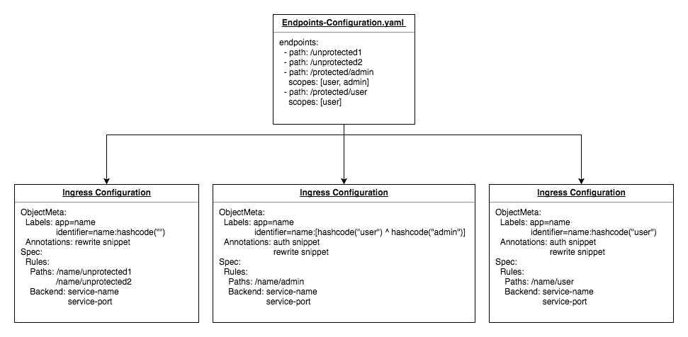

# Endpoints Configuration Design

When developers deploy application containers, there is a set of endpoints that they want to expose to the public. The design choice was made to use a configuration file over a client library to allow developers to expose endpoints for application containers written in any language. This choice was also made to avoid introducing coupling between the Services project and the application containers deployed using it.

## File Specification
To minimize the time spent creating configuration files, a simple `.yaml` specification was designed to define exposed endpoints. This consists of the `endpoints` key and an array of paths as the value. When endpoints are exposed, they are always prefixed with the name provided to the `deploy` operation to avoid path conflicts.

### Examples
#### Basic
Here is a basic specification that exposes the two endpoints `/examplepath1` and `/examplepath2`.
```
endpoints:
  - path: /examplepath1
  - path: /examplepath2
```
If this specification is used when deploying an application container named `example` then the final public paths will be:
1. `https://cluster-ip/example/examplepath1`
2. `https://cluster-ip/example/examplepath2`

#### Advanced
Here is a a simple specification that exposes the three endpoints `/unprotected`, `/protected/user` and `/protected/admin`.
```
endpoints:
  - path: /unprotected
  - path: /protected/user
    scopes: [user]
  - path: /protected/admin
    scopes: [user, admin]
```
If this specification is used when deploying an application container named `example` then the final public paths will be:
1. `https://cluster-ip/example/unprotected`
2. `https://cluster-ip/example/protected/user`
3. `https://cluster-ip/example/protected/admin`

The `/unprotected` endpoint can be accessed normally because it is unprotected. However, accessing `/protected/user` or `/protected/admin` will result in 401 unauthorized. These two endpoints require a valid OAuth2 Access token with all the matching scopes. Scopes provide a simple method for developers to protect their endpoints. Direct matching was used for scopes rather than a hierarchical or regular expression approach for performance reasons.

The first endpoint has the scope `user` meaning the access token must also have the user scope for introspection to succeed.
The second endpoint has the scopes `user` and `admin`. The access token must possess both scopes for introspection to succeed. A token with only the `user` scope or only the `admin` will still receive 401 unauthorized.  

## File Parsing

Endpoints configuration `.yaml` files must be parsed when using the `deploy` and `update` operations. This process involves producing a set of [Kubernetes Ingress](https://kubernetes.io/docs/concepts/services-networking/ingress/) configurations from the file's contents.

When requests to endpoints with scopes are made, the reverse proxy adds the required scopes as a header and forwards the access token to the authorization service. The reverse proxy is responsible for adding the headers to improve performance by removing the need for a path lookup to determine which scopes are required. However, [Kubernetes Ingress](https://kubernetes.io/docs/concepts/services-networking/ingress/) configurations only allow headers to be added using [annotations](https://github.com/kubernetes/ingress-nginx/blob/master/docs/annotations.md) which apply to all paths in the Ingress configuration. Because of this, an Ingress configuration is required for each distinct set of scopes. While this may sound inefficient, all Ingress configurations are handled by a single [nginx ingress controller](https://github.com/kubernetes/ingress-nginx) meaning there is only a slight increase in overhead during deployment.  

### 1. Grouping
The first step during parsing is to group the path's based on their set of scopes. This is done by using the hash code for the set of scopes as the key in map. The hash code for the set of scopes is created by hashing each scope and XORing the results. This allows for the same hash code to be produced even if scopes are listed in a different order. This step results in path groups which consist of a set of scopes and a set of paths that require those scopes.

During this step a hash set of all the paths found in the configuration file is found to return an error if any duplicate paths are discovered.

### 2. Ingress Configurations
Each path group must then be converted to an Ingress configuration.

#### Labels
Each configuration is given a set of labels. The `app=name` label is given to allow lookup of all Ingress configurations associated with a deployed application container. The `identifier=name:hashcode` label is also added tagging each ingress configuration with the deploy name and the hash code of the scopes set. This allows existing Ingress configurations to be looked up if the endpoints for a deployed application container are modified.
#### Annotations
Each configuration is also given a set of annotations. These are required for advanced configuration of the underlying [nginx ingress controller](https://github.com/kubernetes/ingress-nginx).

If the group has one or more scopes then a `configuration-snippet` is added to add the required scopes to the request header and forward the request to the authorization server's introspection endpoint. If introspection succeeds then `proxy_set_header` is used to pass the user id and user scopes that the access token was created for on to the deployed application container. The `configuration-snippet` can be found below.
```
set $scopes group.scopes;
auth_request        /external-auth;
auth_request_set    $auth_cookie $upstream_http_set_cookie;
add_header          Set-Cookie $auth_cookie;
auth_request_set    $authHeader0 $upstream_http_user_id;
proxy_set_header    'User-Id' $authHeader0;
auth_request_set    $authHeader1 $upstream_http_user_scopes;
proxy_set_header    'User-Scopes' $authHeader1;
```
The authorization snippet is only added for groups with one or more required scopes. However, a rewrite `configuration-snippet` is added for all groups. This removes the deploy name from the path before forwarding the request to the deployed application container. This means that if the path is exposed at `https://cluster-ip/example/unprotected` then the application container will receive the request at `/unprotected` instead of `/example/unprotected`. This is accomplished using the following snippet to remove the deploy name.
```
rewrite ^/%v/(.*)$ /$1 break;
```
#### Backend
The last component of the Ingress configuration is the backend that the paths are sent to. This requires a name and port to route requests to the deployed `Kubernetes service`.

#### 3. Diagram


This diagram provides an example of the resulting Ingress configurations from parsing an `Endpoints-Configuration.yaml` file. The set of Ingress configurations is returned as the result of the parsing process.
