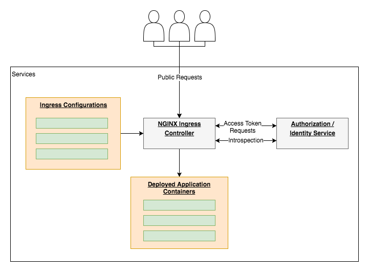
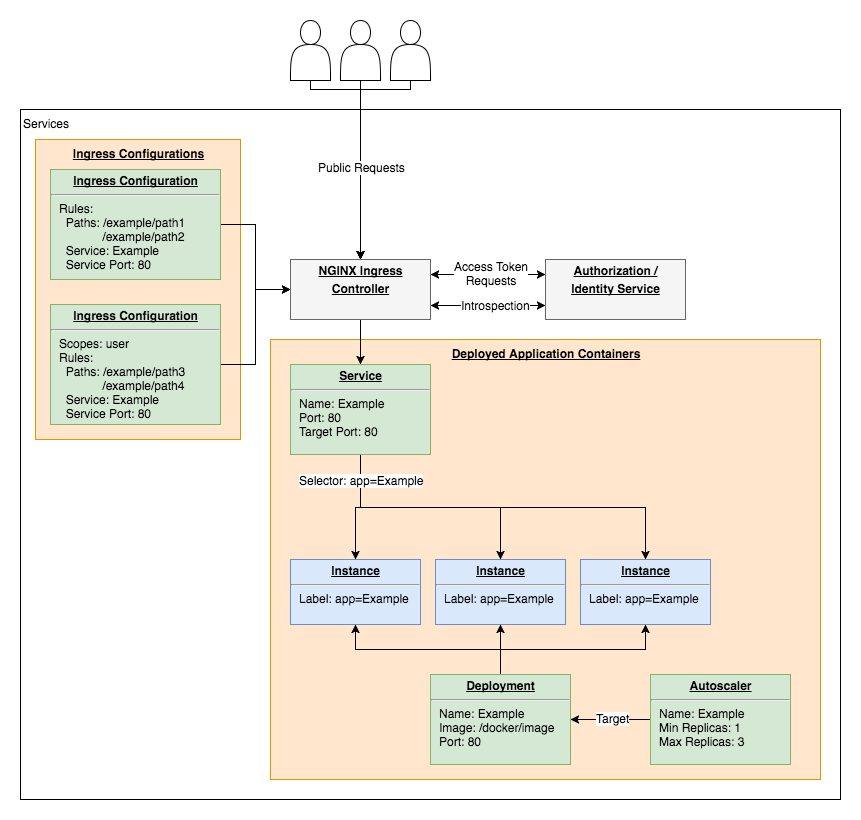

# Gateway Design

The gateway is the entry point into the system for all public traffic. It is responsible for load balancing, routing and protecting endpoints.

This diagram shows the components that make up the gateway. The orange boxes contain components that are created when application containers are deployed to the system. Initially, the only components in the system are the NGINX Ingress controller and the authorization/identity service.

## Routing and Authorization

The system is designed to have the [`NGINX Ingress controller`](https://github.com/AllanKerr/Services/blob/master/gateway/ingress.yaml) handles all public requests and reroute then to internal services. When the controller is first deployed, the authorization/identity service is the only exposed service.

Exposing this service at the `/oauth2/*` path allows for:
1. **Access Token Requests.** OAuth2 requests using the `password` and `client_credentials` grants can be sent to the `/oauth2/token` endpoint.
2. **Account Creation.** New accounts can be created using the `/oauth2/register` endpoint.
3. **Introspection.** Access tokens can be validated against a set of scopes using the `/oauth2/introspection` endpoint.

The [`NGINX Ingress controller`](https://github.com/AllanKerr/Services/blob/master/gateway/ingress.yaml) provides an internal endpoint to proxy requests that require authorization. If a request is sent to an endpoint with a set of required scopes then the request will be proxied to the internal endpoint for token introspection before being passed to the target application container. Designing authorization into the NGINX Ingress controller allows for authorization to be decoupled from all deployed application containers.

## Application Container Components
When developers deploy application containers using the gateway controller, four components are automatically created and configured. These components for a **single** application container are shown below in green. The NGINX Ingress controller is the reverse proxy responsible for routing and is shared between all deployed application containers. The instances in blue represent the instances of the application container running on the cluster which may consist of one or more physical machines.

1. ***Deployment.*** A [Kubernetes Deployment](https://kubernetes.io/docs/concepts/workloads/controllers/deployment/) is created to manage the application container. This allows multiple instances of the container to seamlessly run across multiple machines, deployed application containers to be updated to different [Docker Images](https://docs.docker.com/get-started/part2/) with no downtime and for the deployed application to be automatically restarted in the event of an unexpected failure.
2. ***Autoscaler.*** A [Kubernetes Horizontal Pod Autoscaler](https://kubernetes.io/docs/tasks/run-application/horizontal-pod-autoscale/) is created to automatically scale the deployment based on CPU utilization. The autoscaler is responsible for monitoring the application instances created by the deployment and creating new instances if CPU utilization exceeds 80%.
3. ***Service.*** A [Kubernetes Service](https://kubernetes.io/docs/concepts/services-networking/service/) is created to reference and provide access to the instances managed by the deployment. This exposes the IP addresses of the instances to allow for load balancing and routing.
4. ***Ingress Configurations.*** A set of [Kubernetes Ingresses](https://kubernetes.io/docs/concepts/services-networking/ingress/) are created to expose the service to the public. An ingress configuration is created for each set of endpoint access scopes. A default configuration that routes directly to the service is created for unprotected endpoints while configurations that route to the authorization service's introspection endpoint are created for protected endpoints. These Ingress configurations are applied to the [NGINX Ingress controller](https://github.com/kubernetes/ingress-nginx) that handles all routing.

## Gateway Controller

The gateway controller provides the command line interface for developers to deploy, update and tear down their application containers. This controller is responsible for automatically reconfiguring the gateway giving developers the ability to rapidly deploy and update applications without the need to create or maintain configuration files.

The automatic configuration of these four components is handled through four operations that developers can perform on the gateway controller.

### 1. Deploy
Deploys a new application container in the form of a [Docker Image](https://docs.docker.com/get-started/part2/). This is used by developers to instantly deploy their application containers and results in the automatic configuration and creation of all four deployment components mentioned above.

**[The deploy design can be found here.](./deploy-command-design.md)**

### 2. List
Lists the application containers deployed using the `deploy` operation. This can be used by developers to view the applications that have been deployed to the system.

**[The list design can be found here.](./list-command-design.md)**

### 3. Update
Updates a specified application container found using the `list` operation. This allows for developers to deploy new versions of their application containers with zero downtime.

**[The update design can be found here.](./update-command-design.md)**

### 4. Teardown
Teardown a deployed application container found using the `list` operation. This is used by developers to remove application containers that were previously deployed.

**[The teardown design can be found here.](./teardown-command-design.md)**
